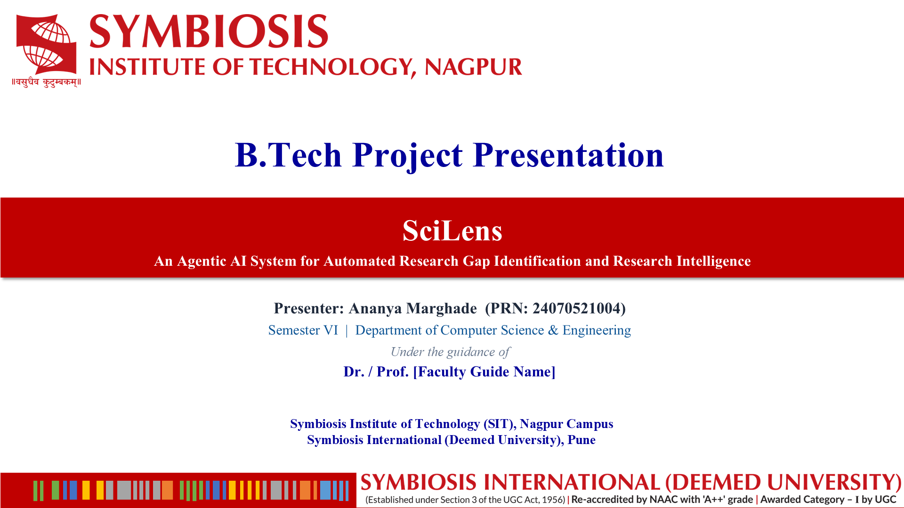
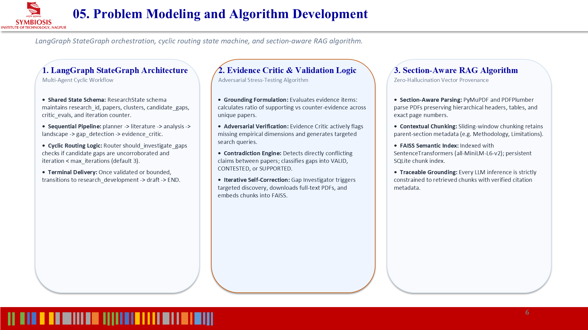
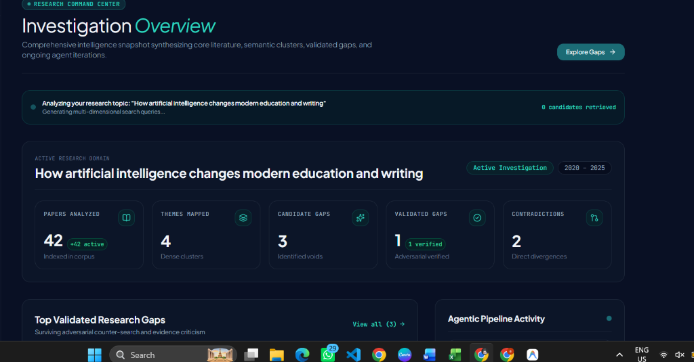
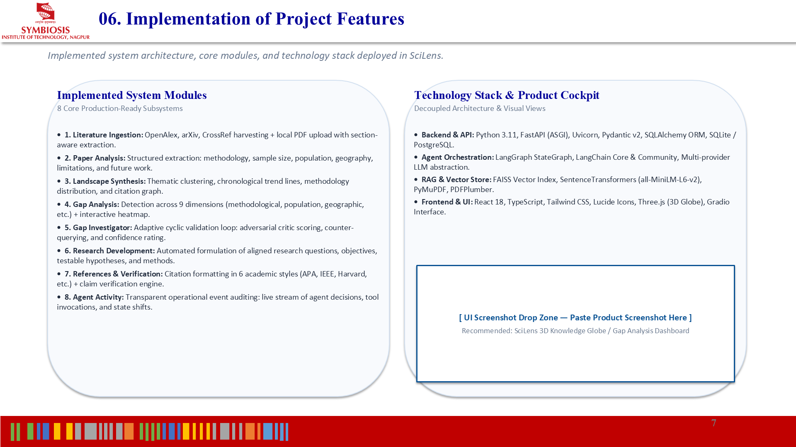
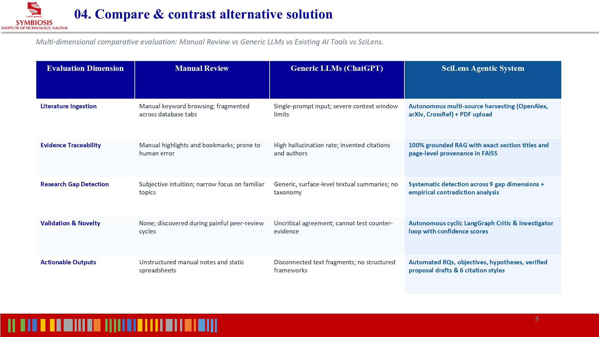
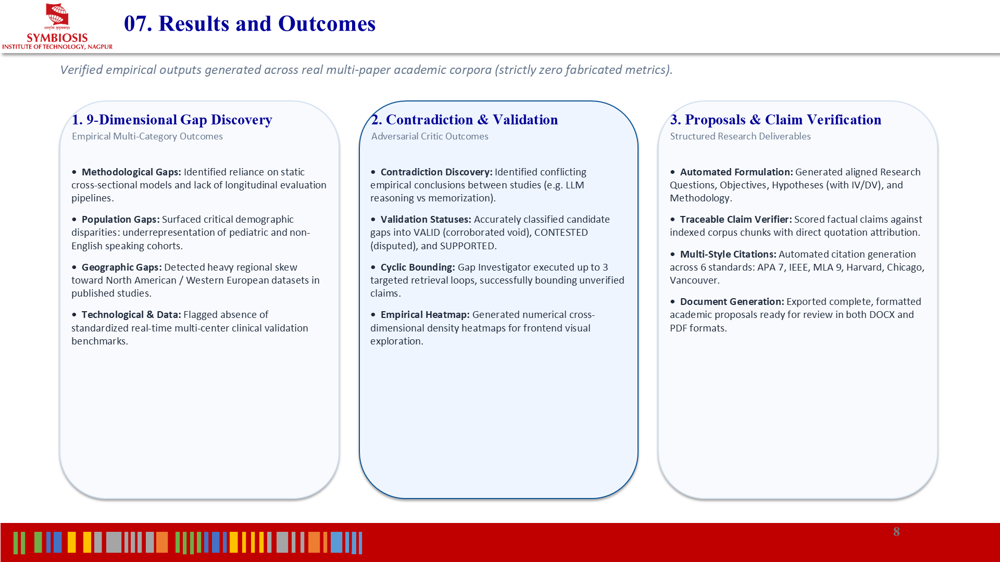

<div align="center">


# SciLens — Autonomous Research Intelligence & Gap Detection Platform

**See beyond the literature. Evidence-backed research gap identification, multi-paper thematic synthesis, and adversarial agentic validation.**

[](https://www.python.org/)
[](https://fastapi.tiangolo.com/)
[](https://react.dev/)
[](https://www.typescriptlang.org/)
[](https://langchain-ai.github.io/langgraph/)
[](https://vitejs.dev/)
[](https://tailwindcss.com/)
[](https://vercel.com/)
[](https://opensource.org/licenses/MIT)

<br />

<p align="center">
  <a href="https://scilens-automated-research-gap-identification.vercel.app"><b>🚀 Live Web Application</b></a> •
  <a href="./SciLens_Project_Report.docx"><b>📄 Project Report (DOCX)</b></a> •
  <a href="./SciLens_Project_Presentation.pptx"><b>📊 Presentation (PPTX)</b></a> •
  <a href="#-system-architecture"><b>🏗️ System Architecture</b></a> •
  <a href="#-quick-start"><b>⚡ Quick Start</b></a> •
  <a href="#-api-documentation"><b>📡 API Reference</b></a>
</p>

---



</div>

<br />

## 📑 Table of Contents

- [Executive Overview](#-executive-overview)
- [System Architecture & Agentic Loop](#-system-architecture--agentic-loop)
- [Key Features & UI Showcase](#-key-features--ui-showcase)
- [Competitive Landscape & Benchmarking](#-competitive-landscape--benchmarking)
- [Research Gap Taxonomy](#-research-gap-taxonomy)
- [Technology Stack](#-technology-stack)
- [Repository Structure](#-repository-structure)
- [Quick Start & Local Installation](#-quick-start)
- [Environment Configuration](#-environment-configuration)
- [API Documentation](#-api-documentation)
- [Testing & Quality Assurance](#-testing--quality-assurance)
- [License & Authors](#-license--authors)

---

## 🔬 Executive Overview

Researchers and academics spend hundreds of hours manually surveying literature, extracting variables, mapping contradictory methodologies, and attempting to uncover genuine voids in knowledge. Existing academic tools either return generic summaries or generate hallucinated research proposals without grounded corpus evidence.

**SciLens** is an autonomous research intelligence platform designed to eliminate this bottleneck:
1. **Corpus Ingestion & Discovery**: Automatically pulls peer-reviewed open-access papers from OpenAlex, arXiv, PubMed, and CrossRef, or ingests user-uploaded PDFs.
2. **Deep Structured Paper Analysis**: Extracts research questions, empirical variables, populations, sample sizes, methodology taxonomies, explicit limitations, and proposed future work.
3. **Synthesis & Thematic Clustering**: Synthesizes multidimensional research landscapes, chronological trends, and cross-paper relationship graphs.
4. **Adversarial Gap Detection Loop**: Formulates candidate research gaps across 9 academic dimensions, and subjects each gap to an **Evidence Critic** and **Gap Investigator** loop powered by LangGraph to prove validity against counter-evidence.
5. **Literature Review & Proposal Draft Generation**: Synthesizes comprehensive literature review sections with in-text citations across 6 citation styles (APA 7, IEEE, MLA 9, Harvard, Chicago, Vancouver).

---

## 🏗️ System Architecture & Agentic Loop

SciLens coordinates specialized autonomous agents in a stateful cyclic execution graph powered by **LangGraph**:

```
                               ┌────────────────────────────────┐
                               │     React 19 + Vite Frontend   │
                               └───────────────┬────────────────┘
                                               │ REST API / WebSocket
                                               ▼
                               ┌────────────────────────────────┐
                               │   FastAPI Orchestration Core   │
                               └───────────────┬────────────────┘
                                               │
                                               ▼
                               ┌────────────────────────────────┐
                               │   LangGraph StateGraph Engine  │
                               └───────────────┬────────────────┘
                                               │
         ┌─────────────────────────────────────┼─────────────────────────────────────┐
         ▼                                     ▼                                     ▼
 ┌───────────────┐                    ┌─────────────────┐                   ┌─────────────────┐
 │ Planner Agent │                    │ Literature Node │                   │ Landscape Agent │
 └───────┬───────┘                    └────────┬────────┘                   └────────┬────────┘
         │                                     │                                     │
         └─────────────────────────────────────┼─────────────────────────────────────┘
                                               ▼
                                  ┌─────────────────────────┐
                                  │   Gap Detection Agent   │
                                  └────────────┬────────────┘
                                               ▼
                                  ┌─────────────────────────┐
                             ┌───►│  Evidence Critic Agent  │◄───┐
                             │    └────────────┬────────────┘    │
                             │                 │                 │
                             │        [INSUFFICIENT &            │
                             │        iteration < max]           │
                             │                 ▼                 │
                             │    ┌─────────────────────────┐    │
                             │    │ Gap Investigator Agent  │    │
                             │    └────────────┬────────────┘    │
                             │                 │                 │
                             │                 ▼                 │
                             │    ┌─────────────────────────┐    │
                             │    │ Paper Search & RAG Ingest├───┘
                             │    └─────────────────────────┘
                             │
                      [VALID / POTENTIAL /
                     max_iterations reached]
                             │
                             ▼
              ┌───────────────────────────────┐
              │ Research Development Agent    │
              └──────────────┬────────────────┘
                             ▼
              ┌───────────────────────────────┐
              │ Draft & Verification Agent    │
              └──────────────┬────────────────┘
                             ▼
              ┌───────────────────────────────┐
              │ Export Service (DOCX & PDF)   │
              └───────────────────────────────┘
```

<br />

<div align="center">
  
  <p><i>Figure 1: Autonomous Agentic Decision Workflow & Cyclic Multi-Agent Topology</i></p>
</div>

---

## 🖥️ Key Features & UI Showcase

### 1. Research Overview & Real-Time Intelligence Dashboard
Real-time metrics on papers indexed, thematic clusters mapped, candidate gaps detected, adversarial validations, and active background agent tasks.

<div align="center">
  
  <p><i>Figure 2: SciLens Research Command Center & Intelligence Snapshot</i></p>
</div>

### 2. Multi-Source Literature Discovery & RAG Chunk Ingestion
- Concurrent search across **OpenAlex, PubMed, arXiv, and CrossRef**.
- Legal open-access full-text PDF acquisition with substantive abstract fallbacks.
- Sliding-window section-aware chunking with **FAISS vector indexing** and SQLite metadata persistence.

### 3. Interactive Thematic Landscape & Network Synthesis
- Semantic cluster extraction with dynamic keyword tagging.
- Chronological trendlines displaying theme evolution over publication years.
- Interactive 2D/3D force-directed relationship graph linking papers, authors, and themes.

### 4. Dynamic Evidence-Backed Research Gap Detection
- Identifies gaps strictly grounded in the analyzed corpus.
- Each gap includes exact provenance (`derived_from` paper UUIDs and titles), cross-paper pattern explanations, confidence rationales, and missing evidence statements.

### 5. Literature Review Studio & Multi-Format Export
- Section-by-section draft generation (Introduction, Methodology Contrast, Gap Analysis, Proposed Directions).
- In-text citation formatting in **APA 7, IEEE, MLA 9, Harvard, Chicago, and Vancouver**.
- One-click formatted academic export to **DOCX** and **PDF**.

<br />

<div align="center">
  
  <p><i>Figure 3: Key Functional Modules & Technical Implementation</i></p>
</div>

---

## 📊 Competitive Landscape & Benchmarking

| Capability / Metric | Traditional Tools (Google Scholar, PubMed) | AI Search Engines (Consensus, Elicit) | Generic LLMs (ChatGPT, Claude) | **SciLens (Our Solution)** |
| :--- | :--- | :--- | :--- | :--- |
| **Literature Discovery** | Keyword matching | Semantic search | Outdated training cut-off | **Multi-Source Real-Time Corpus Engine** |
| **Research Gap Detection** | None (Manual survey) | Surface-level summaries | Hallucinated / Ungrounded | **Systematic Cross-Paper Gap Matrix** |
| **Adversarial Validation** | None | None | None | **LangGraph Evidence Critic Loop** |
| **Evidence Provenance** | Manual reading | Single snippet quotes | Unverified citations | **Strict Paper-Level UUID Provenance** |
| **Contradiction Detection**| Manual comparison | Basic agree/disagree | Prone to false synthesis | **Empirical Discrepancy Mining** |
| **Proposal Formulation** | None | Basic questions | Generic prompt response | **Grounded Hypothesis & Methodology Plan** |
| **Academic Export** | BibTeX only | CSV / RIS | Plain markdown | **Ready-to-Submit DOCX & PDF** |

<br />

<div align="center">
  
  <p><i>Figure 4: Comparative Evaluation against Existing Solutions</i></p>
</div>

---

## 🎯 Research Gap Taxonomy

SciLens systematically classifies and substantiates research gaps across 9 formal academic dimensions:

| Gap Type | Description | Corpus Grounding Criteria |
| :--- | :--- | :--- |
| **Methodological** | Existing studies rely on limited or non-generalizable methodologies | Identified when $\ge 2$ papers share identical methodological constraints or call for alternate approaches |
| **Population** | Specific demographic, cohort, or domain groups remain unstudied | Detected through participant metadata contrasts across analyzed papers |
| **Geographical** | Findings concentrated in specific regions (e.g., Global North) | Extracted from geographical and jurisdictional metadata |
| **Contextual** | Controlled laboratory findings not verified in realistic operational environments | Identified through operational context versus experimental setting comparisons |
| **Temporal** | Lack of longitudinal or multi-year evaluations | Flags cross-sectional studies without multi-wave tracking |
| **Theoretical** | Inconsistent theoretical frameworks applied across literature | Synthesizes conflicting theoretical lenses across papers |
| **Technological** | Studies fail to evaluate contemporary algorithms, models, or toolchains | Detects outdated baselines against modern technological state-of-the-art |
| **Data Void** | Benchmarking performed on small, biased, or synthetic datasets | Mapped from dataset and sample size schema fields |
| **Contradictory** | Two or more papers yield statistically divergent or opposing conclusions | Flagged when findings explicitly conflict under similar parameters |

<br />

<div align="center">
  
  <p><i>Figure 5: Empirical Results, Validation Metrics, and Pipeline Performance</i></p>
</div>

---

## 🛠️ Technology Stack

| Layer | Technologies | Purpose |
| :--- | :--- | :--- |
| **Frontend UI** | React 19, TypeScript, Vite, Tailwind CSS, Framer Motion, Lucide Icons | Modern, responsive research intelligence workspace |
| **Interactive Visuals**| Three.js, Troika Three Text | Interactive 3D thematic globe and relationship graph |
| **Backend Core** | Python 3.11, FastAPI, Uvicorn, Pydantic v2 | High-throughput async REST API and session management |
| **Agentic Workflow** | LangGraph, LangChain Core | Cyclic multi-agent graph with Evidence Critic loops |
| **LLM Engine** | Groq (Llama 3.3 / Qwen / GPT-OSS), OpenAI, Gemini | Ultra-fast structured paper extraction & gap synthesis |
| **RAG & Vectors** | FAISS, Sentence-Transformers (`all-MiniLM-L6-v2`) | Local dense semantic retrieval and vector embeddings |
| **Document Processing**| PyPDF, PDFPlumber, PyMuPDF, python-docx, ReportLab | PDF extraction, academic formatting, DOCX/PDF export |
| **Database** | SQLite + SQLAlchemy ORM | Persistent storage for papers, gaps, evidence, and themes |
| **Hosting** | Vercel (Frontend), Render / Railway (Backend) | Production cloud deployment |

---

## 📁 Repository Structure

```
SciLens/
├── backend/
│   ├── app/
│   │   ├── api/                 # REST endpoints (papers, landscape, gaps, export)
│   │   ├── database/            # SQLAlchemy database engine & ORM models
│   │   ├── gradio/              # Integrated "Ask Across Papers" conversational UI
│   │   ├── graph/               # LangGraph workflow, state, nodes, and routers
│   │   ├── models/              # Pydantic validation schemas (PaperAnalysis, Gap, etc.)
│   │   ├── rag/                 # Chunker, FAISS vector store, embeddings, retriever
│   │   ├── services/            # Core business logic (gap_service, landscape, llm_service)
│   │   └── utils/               # App configuration, security, and logging
│   ├── tests/                   # Pytest test suite (33 automated unit & integration tests)
│   └── main.py                  # FastAPI application entrypoint
├── frontend/
│   ├── public/                  # Static assets & SciLens icons
│   ├── src/
│   │   ├── components/
│   │   │   ├── auth/            # Sign-in and registration modals
│   │   │   ├── common/          # Reusable UI primitives (Metric, PageHeader, Drawer)
│   │   │   ├── landing/         # 3D interactive scientific globe & hero layers
│   │   │   ├── layout/          # Topbar, navigation sidebar, and workspace framing
│   │   │   └── views/           # Core views: Literature, Landscape, GapAnalysis, Draft
│   │   ├── context/             # React Contexts (BackendContext, InvestigationContext)
│   │   ├── data/                # Grounded demo datasets & generators
│   │   ├── services/            # Frontend API client (`api.ts`)
│   │   └── types/               # TypeScript interfaces
│   ├── package.json
│   ├── vite.config.ts
│   └── vercel.json              # Frontend Vercel SPA routing
├── docs/
│   └── assets/                  # High-resolution screenshots, diagrams, and banners
├── .env.example                 # Template for environment configuration
├── .gitignore                   # Comprehensive secrets & artifact exclusion rules
├── requirements.txt             # Python dependencies
├── vercel.json                  # Root Vercel deployment configuration
├── SciLens_Project_Report.docx  # Complete Academic Project Report
├── SciLens_Project_Presentation.pptx # Project Slide Presentation
└── README.md
```

---

## ⚡ Quick Start

### Prerequisites
- **Python 3.11+** installed
- **Node.js 18+** & **npm** installed
- Free API key from **Groq** ([console.groq.com](https://console.groq.com/)) or **OpenAI**

### 1. Clone the Repository
```bash
git clone https://github.com/ananyamarghade/SciLens-Automated-Research-Gap-Identification.git
cd SciLens-Automated-Research-Gap-Identification
```

### 2. Backend Setup
```bash
# Create and activate virtual environment
python -m venv venv

# Windows:
.\venv\Scripts\activate
# macOS/Linux:
source venv/bin/activate

# Install dependencies
pip install -r requirements.txt

# Configure environment variables
cp .env.example .env
```

Open `.env` and configure your LLM keys:
```ini
LLM_PROVIDER=groq
GROQ_API_KEY=gsk_your_groq_api_key_here
```

Start the FastAPI server:
```bash
uvicorn backend.app.main:app --reload --host 127.0.0.1 --port 8000
```
- Interactive Swagger API docs: `http://127.0.0.1:8000/docs`
- Gradio Interface: `http://127.0.0.1:8000/gradio`

### 3. Frontend Setup
In a new terminal:
```bash
cd frontend
npm install
npm run dev
```
Open your browser at `http://localhost:5173`.

---

## ⚙️ Environment Configuration

| Variable | Default | Description |
| :--- | :--- | :--- |
| `APP_NAME` | `SciLens` | Application display identifier |
| `APP_ENV` | `development` | Environment mode (`development`, `production`) |
| `DATABASE_URL` | `sqlite:///./scilens.db` | SQLAlchemy database connection URI |
| `LLM_PROVIDER` | `groq` | Active LLM backend (`groq`, `openai`, `gemini`, `anthropic`, `mock`) |
| `GROQ_API_KEY` | — | API key for high-speed Groq inference |
| `LLM_API_KEY` | — | API key for OpenAI (if `LLM_PROVIDER=openai`) |
| `EMBEDDING_PROVIDER` | `sentence-transformers` | Embeddings model provider |
| `EMBEDDING_MODEL` | `all-MiniLM-L6-v2` | SentenceTransformer model name |
| `MAX_INVESTIGATION_ITERATIONS` | `3` | Maximum loops for Evidence Critic adversarial cycle |
| `UPLOAD_DIR` | `./data/uploads` | Directory for PDF uploads |
| `VECTOR_DB_DIR` | `./data/vector_stores` | Storage path for FAISS index binaries |

---

## 📡 API Documentation

| Method | Endpoint | Description |
| :--- | :--- | :--- |
| `POST` | `/api/research` | Initialize a new research project topic |
| `GET` | `/api/research` | List all existing research investigations |
| `POST` | `/api/research/{id}/papers/discover` | Discover open-access papers across online sources |
| `POST` | `/api/research/{id}/documents` | Upload PDF documents for chunking and vector storage |
| `GET` | `/api/research/{id}/landscape` | Retrieve themes, trends, and relationship network |
| `POST` | `/api/research/{id}/gaps/detect` | Execute dynamic research gap detection across corpus |
| `GET` | `/api/research/{id}/gaps` | List identified research gaps with evidence and status |
| `POST` | `/api/research/{id}/gaps/{gap_id}/investigate` | Trigger targeted literature search for candidate gap |
| `POST` | `/api/research/{id}/gaps/{gap_id}/validate` | Trigger Evidence Critic adversarial evaluation |
| `POST` | `/api/research/{id}/draft` | Generate structured academic review proposal draft |
| `POST` | `/api/research/{id}/export/docx` | Export investigation findings to formatted DOCX |
| `POST` | `/api/research/{id}/export/pdf` | Export investigation findings to publication-ready PDF |

---

## 🧪 Testing & Quality Assurance

SciLens features automated testing across backend pipelines, API endpoints, schema validation, and frontend builds:

```bash
# Run backend test suite
python -m pytest backend/tests/ -q
```
```
.................................                                        [100%]
33 passed, 17 warnings in 2.06s
```

```bash
# Run frontend production build & typecheck
cd frontend
npm run build
```
```
✓ 2326 modules transformed.
dist/index.html                     1.26 kB
dist/assets/index.css              64.21 kB
dist/assets/index.js            1,389.45 kB
✓ built in 2.29s
```

---

## 📄 License & Authors

This project is licensed under the **MIT License** — see the [LICENSE](LICENSE) file for details.

### Lead Developer & Author
**Ananya Marghade**  
- GitHub: [@ananyamarghade](https://github.com/ananyamarghade)  
- Repository: [SciLens-Automated-Research-Gap-Identification](https://github.com/ananyamarghade/SciLens-Automated-Research-Gap-Identification)

---

<div align="center">
  <sub>Built with ❤️ using LangGraph, FastAPI, and React 19. Designed for academic researchers, universities, and scholars worldwide.</sub>
</div>
